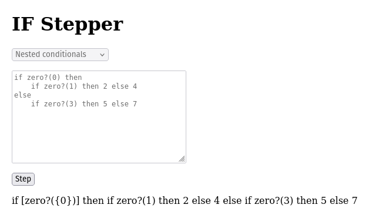

# IF Stepper

A stepper for [IF](https://github.com/tinyinterpreters/if).

## Usage

You'll need [Nix](https://zero-to-nix.com/start/install/) with flakes enabled.

Enter the development environment and start the Elm reactor:

```bash
nix develop
elm reactor
```

Open `http://localhost:8000/` in your browser and click on `src/Main.elm` to run the stepper.

## Example

Here's an example of the stepper working through a nested conditional.



The expression between `[` and `]` is currently being evaluated. The curly brackets, `{` and `}`, are used to denote values which can be either integers or Booleans.
